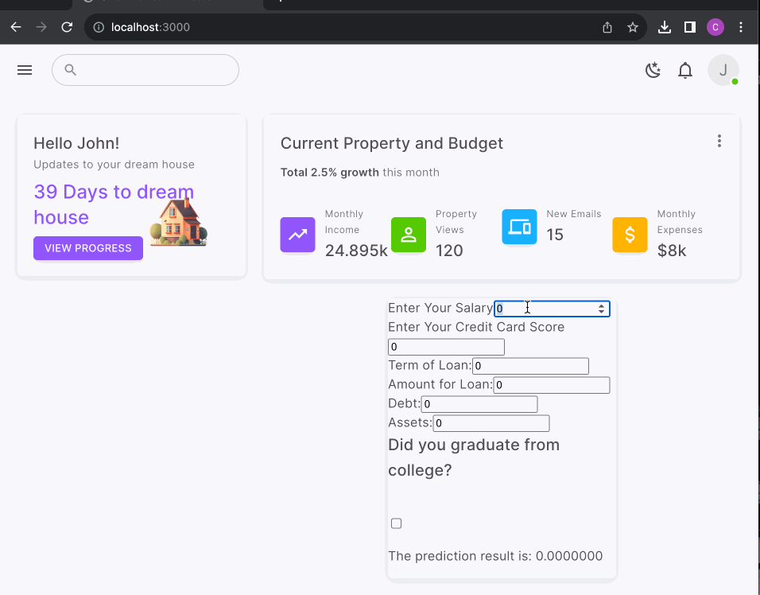
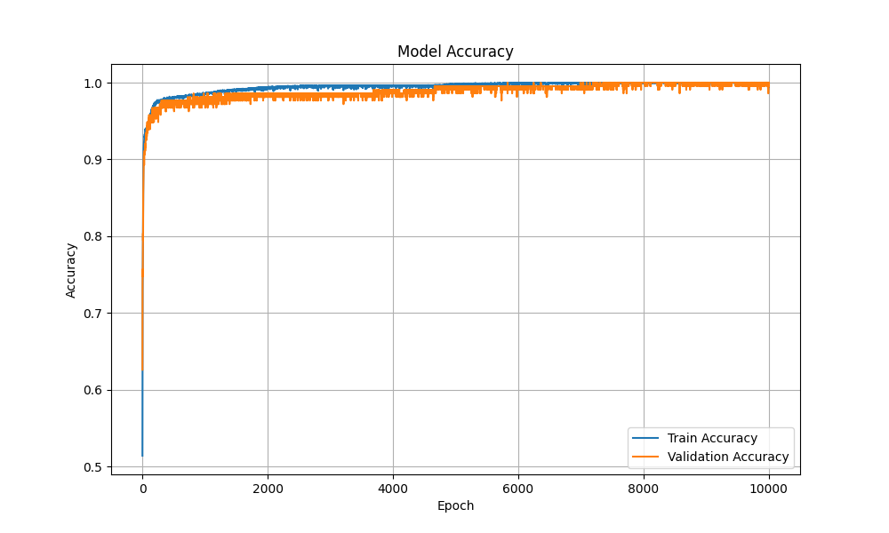

## Inspiration
Being college students, we know the struggles of finding affordable yet suitable locations to live while on campus. After we graduate and get jobs, it will be even harder to find a home especially while keeping a budget. Eventually we want to settle down and live the American dream of owning a home, but with the current housing rates skyrocketing to absurd amounts, it’s very hard to find what is right for you. So we wanted to create a website that implemented machine learning to help the user with their finances to reach their goal of owning their dream home.

## What it does

The website will help with your finances by using machine learning to show what the user needs to do to be able to buy their dream home. We trained the machine to take in the inputs and give the likelihood of being able to buy the house. From the data we found that the factors to percentage relationship is exponential, so it’s usually a clear yes or no with some middle ground. The rest of the website has interfaces that a typical website has, like logins and account information. As well as an in progress house search section that will show a house that fits what the users want. 




## How we built it
We programmed it on Visual Studio IDE mainly using TypeScript and JavaScript as well as importing React. (Explain how machine learning works). We a dataset from Kaggle which consisted of peoples credits history and also various finical information to predict if they would be accepted for a loan. We had four layers in the model and used "swish" for two of the activation layers because it started with an "s" and I was tired. After all this model was written at ~3am. 
```py
model = tf.keras.Sequential([
    tf.keras.layers.Dense(20, activation='swish', input_shape=(X_train.shape[1],)),
    tf.keras.layers.Dense(15, activation='swish'),
    tf.keras.layers.Dense(10, activation='tanh'),
    tf.keras.layers.Dense(1, activation='sigmoid') 
])

```
It was compared with the previous model and I saw that it had a slightly better result at training so just left it. 



Github helped us with some style code and interfaces.  
## Challenges we ran into
During Saturday night our host computer crashed while working on the interface for machine learning and graphs. We lost most of our work for that but luckily we had a previous version saved on GitHub. We didn’t have enough time to fix the formatting for the graph and input interface but the machine learning program works.
## Accomplishments that we're proud of
Programming both a website and a machine learning program that helps us and other people who need it.
## What we learned
We learned that Web Development and React are compared to other languages, but we eventually learned how to use them eventually.
## What's next for Smart Homes
If we get more resources and partners from Capital One and CoStar, we can implement some of their interfaces and API to make our budgeting and home finding website the one we envisioned.


## How to run

* Clone the repository 
* Go to the director and type
```js
npm install 
```
* Then run 
```
npm run dev
```